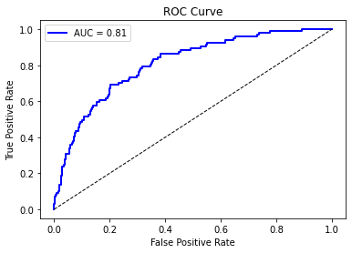

# Customer Churn Prediction

## Project Overview
This project focuses on predicting customer churn for a telecom company using machine learning. The goal is to identify customers at risk of leaving, enabling proactive retention strategies. Various classification models were developed, tuned, and evaluated to select the most suitable model for business use.

## Dataset
- **Source:** Internal telecom customer data  
- **Size:** 3,333 customers  
- **Features:** 21 columns including usage metrics, customer service calls, and plan information  
- **Target:** `churn` (Boolean indicating if the customer left)  

## Data Preparation
- Separated features (`X`) and target (`y`)  
- Performed train-test split (80-20) with stratification  
- Identified numeric and categorical features  
- Applied preprocessing:  
  - Scaling for numeric features  
  - One-hot encoding for categorical features  

## Exploratory Data Analysis

### Customer Churn Distribution
The distribution of churned vs. non-churned customers is visualized below:  

  

*Interpretation:* The dataset is imbalanced, with more non-churned customers than churned customers. This informs the need for careful handling of class imbalance during model training.

## Models Built
1. **Baseline Logistic Regression**  
   - Simple logistic regression to establish a performance baseline  

2. **Tuned Logistic Regression**  
   - Adjusted regularization (`C=0.5`) and class weights to handle class imbalance  
   - Achieved improved recall for churned customers  

3. **Decision Tree**  
   - Nonparametric model with `max_depth=5` and `min_samples_split=20`  
   - Captures nonlinear patterns in the data  
   - Higher overall accuracy but slightly lower interpretability  

## Model Evaluation

### Classification Report
The performance metrics for the tuned logistic regression model are summarized below:

| Class   | Precision | Recall | F1-Score | Support |
|---------|-----------|--------|----------|--------|
| False   | 0.88      | 0.96   | 0.92     | 570    |
| True    | 0.53      | 0.65   | 0.59     | 150    |
| **Accuracy** |           |        | 0.86     | 720    |
| **Macro Avg** | 0.70      | 0.81   | 0.76     | 720    |
| **Weighted Avg** | 0.82      | 0.86   | 0.83     | 720    |

### ROC Curve & AUC
The ROC (Receiver Operating Characteristic) curve shows the model's ability to distinguish churned vs. non-churned customers.  

- **AUC (Area Under the Curve):** 0.81  
- *Interpretation:* The model performs well at ranking customers by risk of churn. It is strong for non-churners and reasonably effective for churners.

## Final Model Selection
The tuned logistic regression model was selected as the final model due to its balance between recall, interpretability, and stability, making it suitable for actionable business insights.

## Findings
- Customer churn can be predicted with reasonable accuracy using classification models  
- Usage behavior, service plans, and customer service interactions are key predictors  
- Tuning hyperparameters improves model performance, particularly recall for minority classes  

## Limitations
- Models may underperform for rare or unusual usage patterns  
- Predictions are probabilistic, not absolute  
- Feature selection and preprocessing may impact generalizability  

## Recommendations
- Prioritize retention efforts for customers identified as high-risk  
- Use targeted offers or proactive engagement to reduce churn  
- Future work: explore ensemble models, additional behavioral data, or real-time prediction updates  

## Conclusion
The project demonstrates that machine learning can provide actionable insights into customer churn. While the baseline logistic regression model performs well for predicting non-churn customers, improving recall for churned customers remains a key challenge. Applying advanced models, hyperparameter tuning, and techniques to handle class imbalance can further enhance prediction performance, helping the company implement more effective customer retention strategies.

